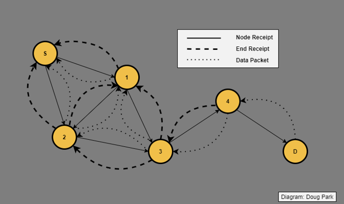
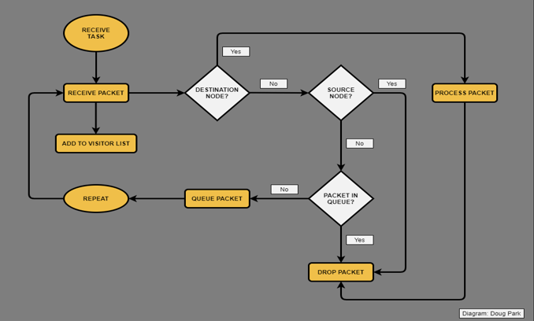
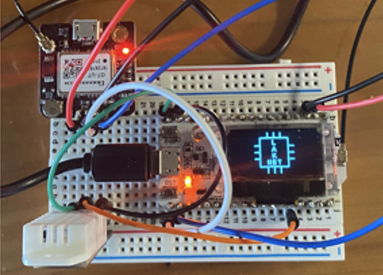
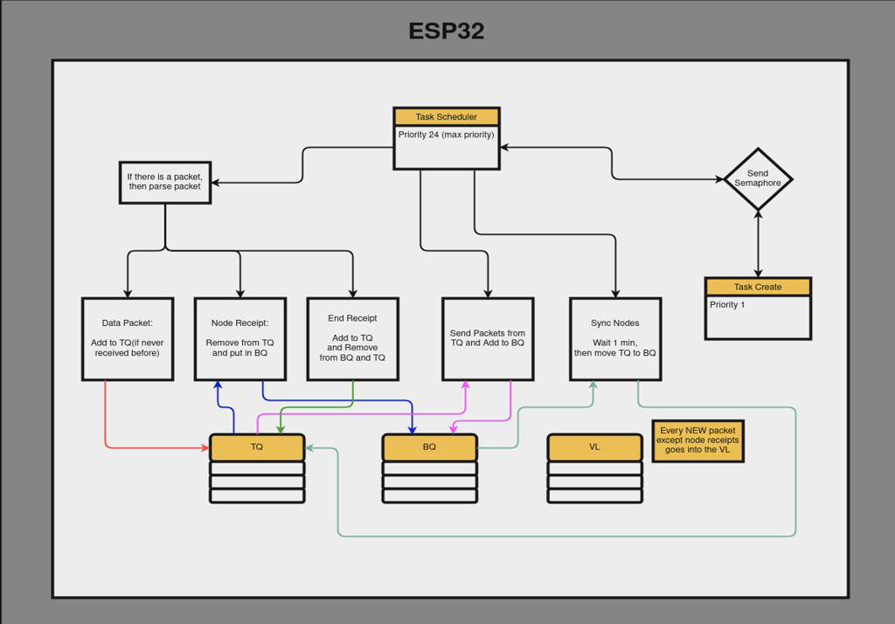

# LakeNet - Stateless Broadcast Network Protocol for LoRa
Ronnie Keating, Nate Osterberg, Luke Ryssel
## Objective
The goal of this project is to develop a mesh network of nodes to be placed in buoys around lake Coeur d'Alene. These buoys will contain ESP-32 modules to monitor and record data such as O2 content, water temperature, and air temperature around the lake, and send that data back to a database in Coeur d'Alene to help with future lake reclamation projects.  
  
## Value Proposition
The lakes and waters of North Idaho and the surrounding areas need environmental monitoring and data gathering in order to maintain the health of the bodies of water. There is a need to create some sort of system that can be implemented into the lakes to collect data in an efficient and low-cost manner. The goal of this project is to implement ESP32s, low-powered microcontrollers, into these bodies of water to create a network of nodes using LoRa, or Long Range communication. This solution will be inexpensive and will also require little maintenance, while also providing frequent information gathering.  
  
## Background
North Idaho has an extensive mining history that has created environmental problems that threaten Lake Coeur d'Alene. Currently, 75 million metric tons of contaminated sediment on the lake bed are the focus of ongoing cleanup by the EPA. The computer science department at the University of Idaho is involved in Our Gem Coeur d'Alene Lake Collaborative to "preserve lake health and protect water quality." Our team is tasked with creating a low-cost, low maintenance mesh network of nodes to collect data about the lakes of Coeur d'Alene to aid in the environmental monitoring of the lake.  
  
## Project Requirements
The project needed an implementation of a real-time operating system in the Stateless Broadcast Network Protocol for LoRa (SBNPL), along with a minimum of four nodes in the network. There also needed to be sensors to collected data about the lake, like temperature, humidity, O2, etc. A gateway node (connected to Internet) is also needed to store data into a database. SBNPL is a protocol designed by Doug Park, which also needed to be implemented and was the basis of the goal of the project.  
  
## Concept Development

## Final Design
The network nodes consist of a Neo-6M GPS with a temperature and humidity sensor. The board is a Heltec WiFi & LoRa ESP-32 with an OLED display.  

  

This is a simple block diagram of how a node in the network works.  

  

# Thanks
Client: Dr. John Shovic  
Instructor: Bruce Bolden  
Mentor: Doug Park
